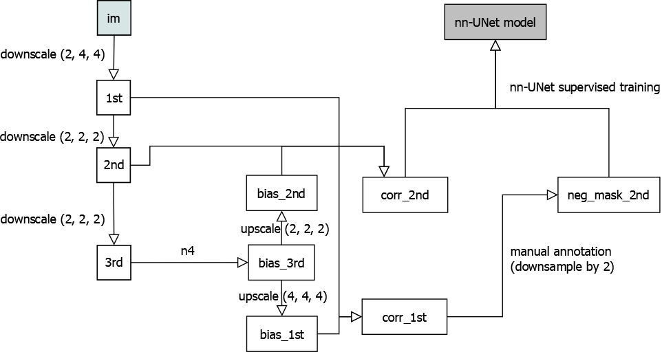
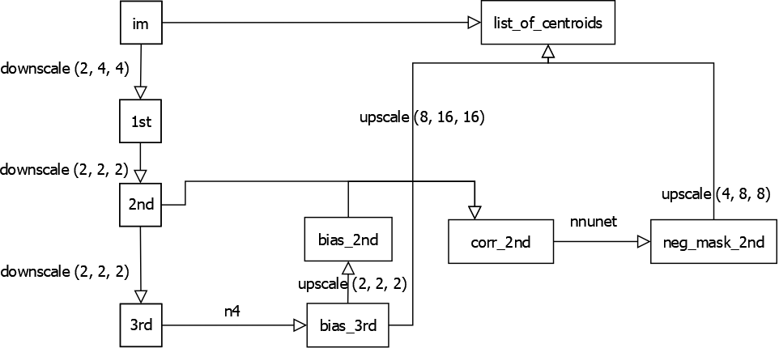

.. _beta_amyloid_plaque_detection:

Beta-Amyloid Plaque Detection
#############################

Workflow Overview
*****************

This section pertains to mouse brain lightsheet data, in effort to quantify the locations and sizes of plaques
in a mouse brain lightsheet scan image.

Below are figures illustrating an overview of the training and prediction stages of the pipeline, ultimately
processing image volumes each to a list of centroids:

    training workflow, overview

    prediction workflow, overview

Things to note:

1. n4 calculation is calculated at third downsample (i.e. (8, 16, 16) times downsampled compared to original)
level as the n4 bias correction is a smooth operation insensitive to small location change. It runs slowly
on large images so easier to work with using a smaller input.

2. The final step of prediction workflow involves 3 inputs: Original full resolution image, third downsampled
bias image, and second downsampled negative mask prediction. The image is first masked by upsampled negative
mask, then corrected by the upsampled bias image. Finally, the corrected image is used to compute the list
of centroids.

3. The goal of the training workflow is to obtain the model file; after which the model file may be uploaded
to cloud to be downloaded somewhere else where prediction workflow needs to be run. Unlike other operations
that can be done on cloud, nn-UNet predicts on local files and write to a local output location (though you
can write a wrapper that wires the input and output to cloud locations).

4. Rather than nearest neighbor, downsampling is done using max-pooling to avoid a shift in image origin
location after downsampling. For up-sampling, this is not an issue.

Python Implementation
*********************

For more information about nn-UNet related annotation, training and prediction, refer to the
`nn-UNet <GettingStarted/nnunet>`_ page.

Below draws example from the file :code:`cvpl_tools/examples/mousebrain_processing.py` to explain how various
steps in the above diagram is done via code. We start with an image on network in OME ZARR file and would
like to obtain a final counting of list of centroids of where plaques are at.

- Downsampling

.. code-block:: Python

    print(f'first downsample: from path {subject.OME_ZARR_PATH}')
    first_downsample = lightsheet_preprocess.downsample(
        subject.OME_ZARR_PATH, reduce_fn=np.max, ndownsample_level=(1, 2, 2), ba_channel=subject.BA_CHANNEL,
        write_loc=subject.FIRST_DOWNSAMPLE_PATH
    )
    print(f'first downsample done. result is of shape {first_downsample.shape}')

    second_downsample = lightsheet_preprocess.downsample(
        first_downsample, reduce_fn=np.max, ndownsample_level=(1,) * 3,
        write_loc=subject.SECOND_DOWNSAMPLE_PATH
    )

Here, :code:`lightsheet_preprocess.downsample` is a function that outputs a dask array, and also writes to
local disk at :code:`write_loc`. This location can be either local or on a gcs cloud bucket. Writing to cloud
allow us to switch coiled cloud computing if needed, as the file location is not bound to our local laptop.

BA_CHANNEL stands for beta-amyloid channel, which is an integer selecting the channel of the image we want
to process. the downsample function takes this parameter for 4d images, but can skip for 3d images.

- n4

.. code-block:: Python

    import cvpl_tools.nnunet.n4 as n4

    third_downsample_bias = await n4.obtain_bias(third_downsample, write_loc=subject.THIRD_DOWNSAMPLE_BIAS_PATH)
    print('third downsample bias done.')

    print(f'im.shape={second_downsample.shape}, bias.shape={third_downsample_bias.shape}; applying bias over image to obtain corrected image...')
    second_downsample_bias = dask_ndinterp.scale_nearest(third_downsample_bias, scale=(2, 2, 2),
                                                         output_shape=second_downsample.shape, output_chunks=(4, 4096, 4096)).persist()

    second_downsample_corr = lightsheet_preprocess.apply_bias(second_downsample, (1,) * 3, second_downsample_bias, (1,) * 3)
    asyncio.run(ome_io.write_ome_zarr_image(subject.SECOND_DOWNSAMPLE_CORR_PATH, da_arr=second_downsample_corr, MAX_LAYER=1))
    print('second downsample corrected image done')

:code:`coiled_run` can be used instead if local laptop can not install :code:`antspyx` library, as follows:

.. code-block:: Python

    async def compute_bias(dask_worker):
        third_downsample = ome_io.load_dask_array_from_path(subject.THIRD_DOWNSAMPLE_PATH, mode='r', level=0)
        await n4.obtain_bias(third_downsample, write_loc=subject.THIRD_DOWNSAMPLE_BIAS_PATH)
    if not RDirFileSystem(subject.THIRD_DOWNSAMPLE_BIAS_PATH).exists(''):
        cvpl_nnunet_api.coiled_run(fn=compute_bias, nworkers=1, local_testing=False)
    third_downsample_bias = ome_io.load_dask_array_from_path(subject.THIRD_DOWNSAMPLE_BIAS_PATH, mode='r', level=0)

- upscale

.. code-block:: Python

    second_downsample_bias = dask_ndinterp.scale_nearest(third_downsample_bias, scale=(2, 2, 2),
                                                         output_shape=second_downsample.shape, output_chunks=(4, 4096, 4096)).persist()

This step takes apparently redundant :code:`output_shape` parameter alongside scale and the pre-scaled image. However, downscale and
upscale often has to deal with integer division issues, while the scale is whole number, the larger image size may
not be a perfect multiple of the size of the image to be scaled. :code:`output_shape` adjusts for this by crop or pad the
resulting image with zeros.

- uploading bias and negative mask

.. code-block:: Python

    if not RDirFileSystem(subject.GCS_NEG_MASK_TGT).exists(''):
        cvpl_nnunet_api.upload_negmask(
            subject.NNUNET_OUTPUT_TIFF_PATH,
            subject.GCS_NEG_MASK_TGT,
            subject.THIRD_DOWNSAMPLE_BIAS_PATH,
            f'{subject.SUBJECT_FOLDER}/.temp',
            subject.GCS_BIAS_PATH
        )

This is an intermediate step not drawn in the diagram. It simply uploads the bias image and nn-UNet output
negative mask to cloud, since those are computed locally in :code:`mousebrain_processing.py`

- computing list of centroids

.. code-block:: Python

    ppm_to_im_upscale = (4, 8, 8)
    async def fn(dask_worker):
        await cvpl_nnunet_api.mousebrain_forward(
            dask_worker=dask_worker,
            CACHE_DIR_PATH=subject.COILED_CACHE_DIR_PATH,
            ORIG_IM_PATH=subject.OME_ZARR_PATH,
            NEG_MASK_PATH=subject.GCS_NEG_MASK_TGT,
            GCS_BIAS_PATH=subject.GCS_BIAS_PATH,
            BA_CHANNEL=subject.BA_CHANNEL,
            MAX_THRESHOLD=subject.MAX_THRESHOLD,
            ppm_to_im_upscale=ppm_to_im_upscale
        )
    cvpl_nnunet_api.coiled_run(fn=fn, nworkers=10, local_testing=False)

:code:`ppm_to_im_upscale` is the scale from negative mask image to the size of the original image. This is
the final step of the prediction workflow, where we will obtain our list of centroids from gcs after running
this. In a local test (without coiled, but still using gcs), we may set :code:`local_testing=True`

Here, the MAX_THRESHOLD variable specifies the threshold above which objects will be counted as plaque. This
threshold is applied over corrected ome zarr image based on the original image and bias image provided.
